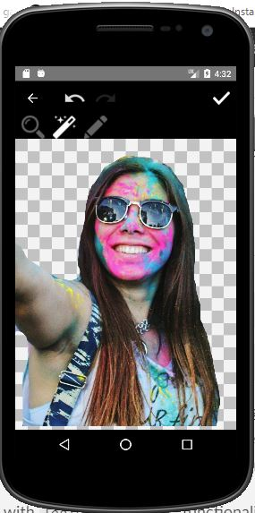

<div align="center">

  <h1>
    ✂️
    Android-CutOut
  </h1>
  Android image background cutting library
</div>


## Usage

Add Gradle dependency:
```groovy
implementation 'com.github.gabrielbb:cutout:0.0.2'
```

Start the CutOut screen with this single line:

```java
CutOut.activity().start(this);
```


 &nbsp; 


## Features

 &nbsp;  &nbsp; 

## Options

You can use one or more options from these:

```java
        CutOut.activity()
                    .src(uri)
                    .bordered()
                    .noCrop()
                    .ad()
                    .intro()
                    .start(this);
```

 - #### src

By default the user can select images from camera or gallery but you can also pass an `android.net.Uri` of an image that is already saved:

  ```java
Uri uri = Uri.parse("/images/cat.jpg");

CutOut.activity().src(uri).start(this);
```


 - #### bordered

  ```java
CutOut.activity().bordered().start(this);
```

This option makes the final PNG have a border around it. The default border color is White. You can also pass the `android.graphics.Color` of your choice.


 - #### noCrop

  ```java
CutOut.activity().noCrop().start(this);
```

By default and thanks to this library: [Android-Image-Cropper](https://github.com/ArthurHub/Android-Image-Cropper), the user can crop or rotate the image. This option disables that cropping screen.


 - #### intro

  ```java
CutOut.activity().intro().start(this);
```

Display an intro explaining every button usage. The user can skip the intro and it is only shown once. The images displayed in the intro are the same you saw in the "Features" section of this document


 - #### ad

  ```java
CutOut.activity().ad(“admob-banner-ad-id”).start(this);
```

Display an  [Admob Banner Ad](https://developers.google.com/admob/android/banner) at the bottom of the screen. To make this work make sure to do everything explained here beforehand: [Get Started with Admob Ads](https://developers.google.com/admob/android/quick-start).
